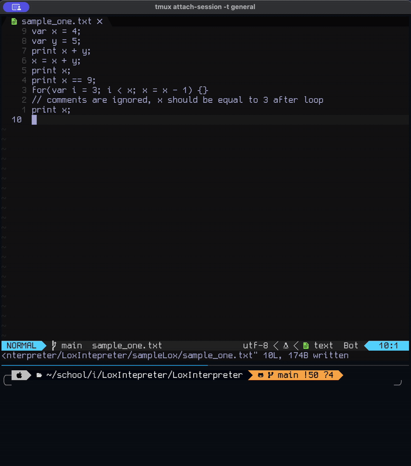
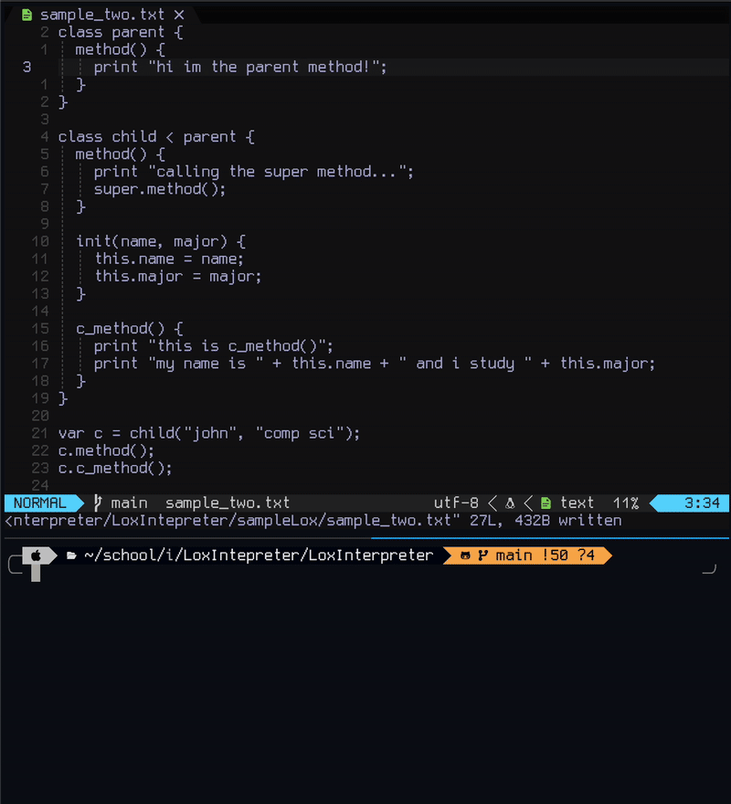
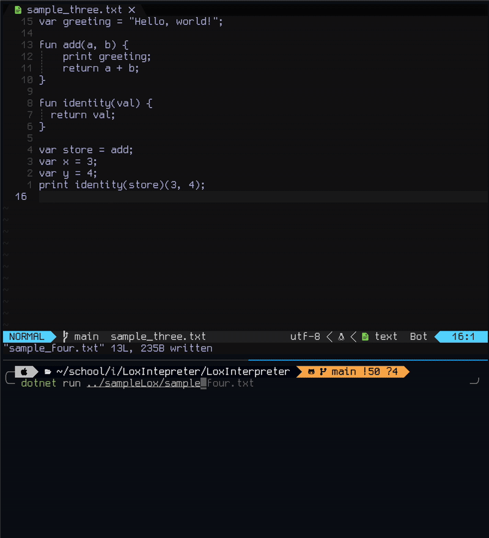
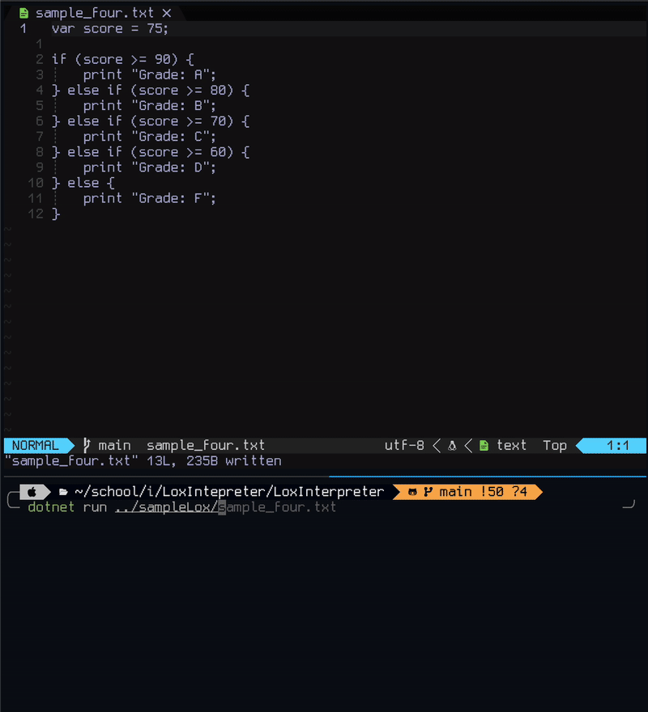
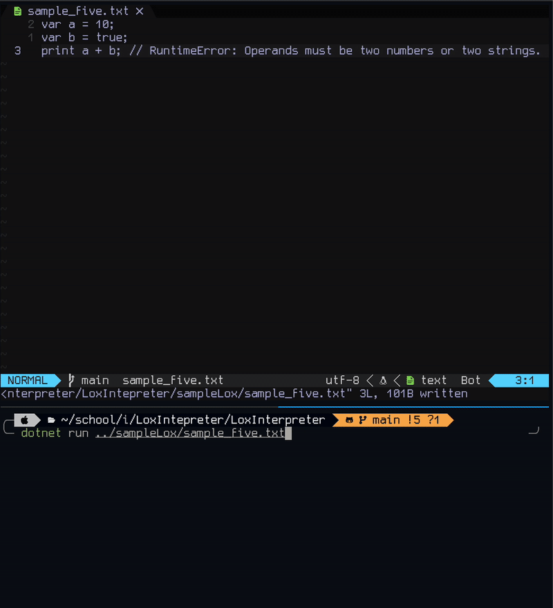

# Lox Interpreter

An interpreter for the Lox programming language implemented in C#.
This implementation is guided by the Java version from [Crafting Interpreters](https://craftinginterpreters.com/) by Robert Nystrom.

This implementation also includes unit testing of the Lexer and Parser
using Xunit.

There is also set of notes type-setted in Latex for some of the chapters. 

## Lox Language Features

- Variable declaration and assignment
- Arithmetic operators (including string concatenation on '+')
- Logical comparison operators
- Control flow: `if`, `else if`, `else`
- Functions with parameters and return values
- Classes with methods and inheritance
- First Order Functions and Classes
- Lexical Scoping
- For Loops
- Error Statements with Line numbers and Metadata
- `print` statements

## Demo

### Demo 1: Variables, Arithmetic, For Loops, and Logical Comparisons



```lox
var x = 4;
var y = 5;
print x + y;
x = x + y;
print x;
print x == 9;
for(var i = 3; i < x; x = x - 1) {}
// comments are ignored, x should be equal to 3 after loop
print x;
```

**Output:**

```
9
9
True
3
```

### Demo 2: Classes, Inheritance, Methods, Init, and Super



```lox
class parent {
  method() {
    print "hi im the parent method!";
  }
}

class child < parent {
  method() {
    print "calling the super method...";
    super.method();
  }

  init(name, major) {
    this.name = name;
    this.major = major;
  }
  c_method() {
    print "this is c_method()";
    print "my name is " + this.name + " and i study " + this.major;
  }
}

var c = child("john", "comp sci");
c.method();
c.c_method();

```

**Output:**

```
calling the super method...
hi im the parent method!
this is c_method()
my name is john and i study comp sci
```

### Demo 3: Functions as First-Class Citizens and Closures



```lox
var greeting = "Hello, world!";

fun add(a, b) {
    print greeting;
    return a + b;
}

fun identity(val) {
  return val;
}

var store = add;
var x = 3;
var y = 4;
print identity(store)(3, 4);

```

**Output:**

```
Hello, world!
7

```

### Demo 4: Control Flow (`if` / `else if` / `else`)



```lox
var score = 75;

if (score >= 90) {
    print "Grade: A";
} else if (score >= 80) {
    print "Grade: B";
} else if (score >= 70) {
    print "Grade: C";
} else if (score >= 60) {
    print "Grade: D";
} else {
    print "Grade: F";
}

```

**Output:**

```
C
```

### Demo 5: Runtime Errors



```lox
var a = 10;
var b = true;
print a + b; // RuntimeError: Operands must be two numbe
```

**Output:**

```
Operands must be two numbers or two strings
[line 3]
```
